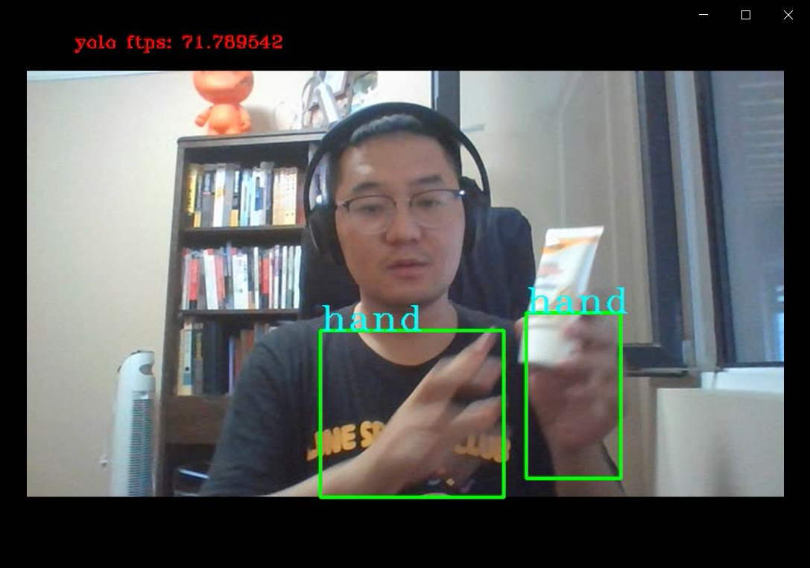
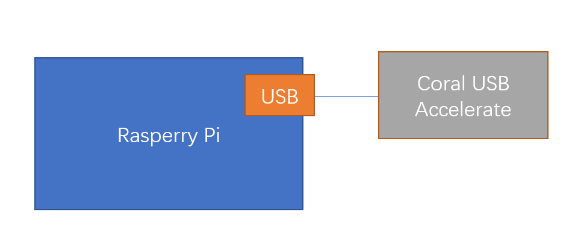
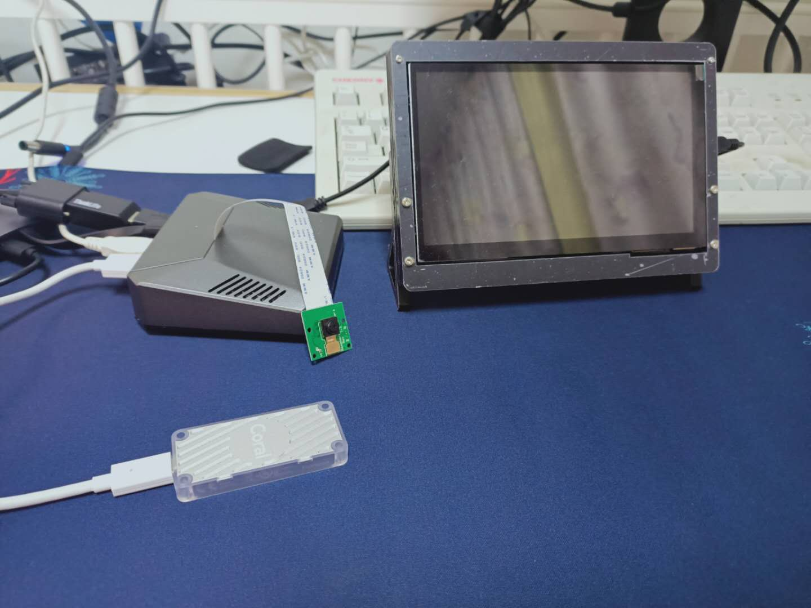

# Handtracking_Raspberry_Pi

# Handtrakcing on Rasberry Pi #
This repo is about how to run a deep leanrning handtracking model on Rasberry Pi machine, which installed essencial model running environment, such as tensorflow, tensorflow edgetpu and so on.
This repo is inspired by a handtracking repo on github:[https://github.com/victordibia/handtracking](https://github.com/victordibia/handtracking "handtracking") .The repo include the hand detection model, pb file and tflite file. However, when I tried to convert the file to edgetpu model, it failed. Therefore, I trained the model myself and run the edgetpu model on the Pi machine successfully, and the FTPS reach about 25~. What's more, when it runs on PC machine, the FTPs is beyond 40. The PC demo runs as below:

# How it works #
This system should inlucde 3 components: **Rasperry Pi**, **Camera**, **Coral Usb Accelerator**(Reference: [https://coral.ai/products/](https://coral.ai/products/))

This repo build on Python3.6, tensorflow 1.15.x, edgetpu.
Prepare the environment and run an inference on the Edge TPU as referred: [https://coral.ai/docs/accelerator/get-started/#1c-on-windows](https://coral.ai/docs/accelerator/get-started/#1c-on-windows)

# How to run live camera #
This code can run on PC and Raspberry machine, referred to the original examples from Coral repo([https://github.com/google-coral/tflite.git](https://github.com/google-coral/tflite.git))

    python detect_camera.py